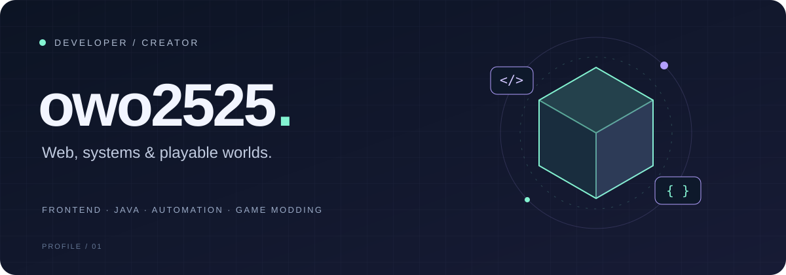

<p align="center">
  
</p>

<p align="center">
  <strong>Interfaces, systems, and game worlds.</strong><br />
  From web apps and automation to Minecraft mods and FiveM scripts.<br />
  I choose the languages and frameworks that fit what I want to build.
</p>

<p align="center">
  <a href="https://github.com/owo2525?tab=repositories"><strong>Explore my repositories ↗</strong></a>
</p>

<br />

## 01 / About me

Hi, I'm **owo2525**.

I build frontend interfaces, Java applications and batch jobs, automation scripts, and game extensions.

```text
browser  →  HTML / CSS / SCSS / JavaScript / TypeScript
app      →  React / Next.js / Angular / Node.js / Laravel / Spring
data     →  SQL / MySQL / PostgreSQL
delivery →  AWS / Docker / Jenkins / GitHub / GitLab
scripts  →  Python / Shell
worlds   →  Minecraft Mod / FiveM
```

<br />

## 02 / Tech stack

### Frontend


**HTML · CSS · SCSS · JavaScript · TypeScript**<br />
From styling web pages to building interfaces with TypeScript.

### Frameworks & State Management


**React · Next.js · Angular · Vite · Redux · Akita**<br />
Building web applications and managing application state.

### Java & Spring


**Java · Spring Boot · Spring Batch**<br />
Developing applications and batch processing jobs.

### Backend & Databases


**Node.js · PHP · Laravel · SQL · MySQL · PostgreSQL**<br />
Building server-side applications and working with databases.

### Cloud & Delivery


**AWS · Docker · Jenkins**<br />
AWS：IAM / S3 / CloudFront / Lambda and more.<br />
Working with cloud services and containers, and automating builds and deployments.

### Collaboration & Design


**Git · GitHub · GitLab · Notion · Figma**<br />
From version control to documentation and design.

### Scripting & Automation


**Python · ShellScript**<br />
Writing scripts and tools to automate everyday tasks.

### Game Development


**Minecraft Mod / Java · FiveM / Lua**<br />
Bringing custom features into game worlds.

<br />

## 03 / What I build

| Area                          | Focus                                       | Stack                                       |
| :---------------------------- | :------------------------------------------ | :------------------------------------------ |
| 🖥️ **Web interfaces**         | Web UI & state management                   | React, Next.js, Angular, Vite, Redux, Akita |
| ⚙️ **Applications & batches** | Server-side apps & batch jobs               | Node.js, Laravel, Spring Boot, Spring Batch |
| 🗃️ **Data & storage**         | Data operations with SQL                    | MySQL, PostgreSQL                           |
| ☁️ **Cloud & delivery**       | Cloud environments & development automation | AWS, Docker, Jenkins                        |
| 🧰 **Useful scripts**         | Tools for everyday tasks                    | Python, Shell                               |
| 🎮 **Game extensions**        | Minecraft mods & FiveM scripts              | Java, Lua                                   |

<br />

---

<p align="center">
  <sub><strong>owo2525</strong> &nbsp; / &nbsp; WEB · SYSTEMS · SCRIPTS · WORLDS</sub><br />
  <sub>Thanks for stopping by.</sub>
</p>
